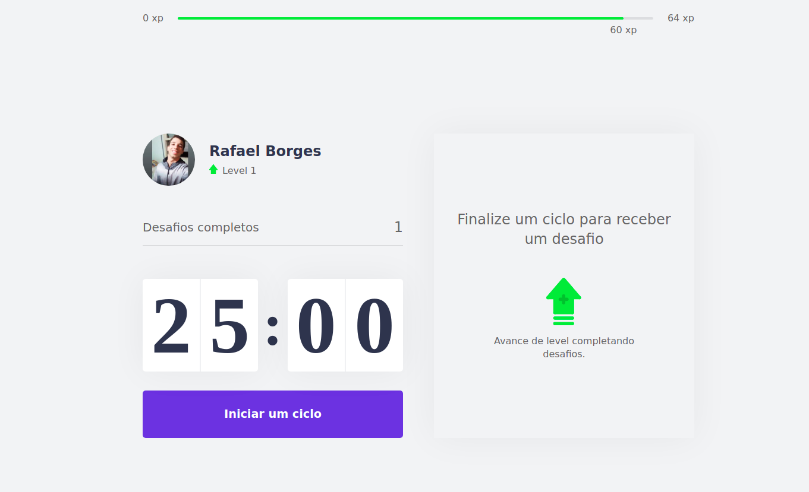
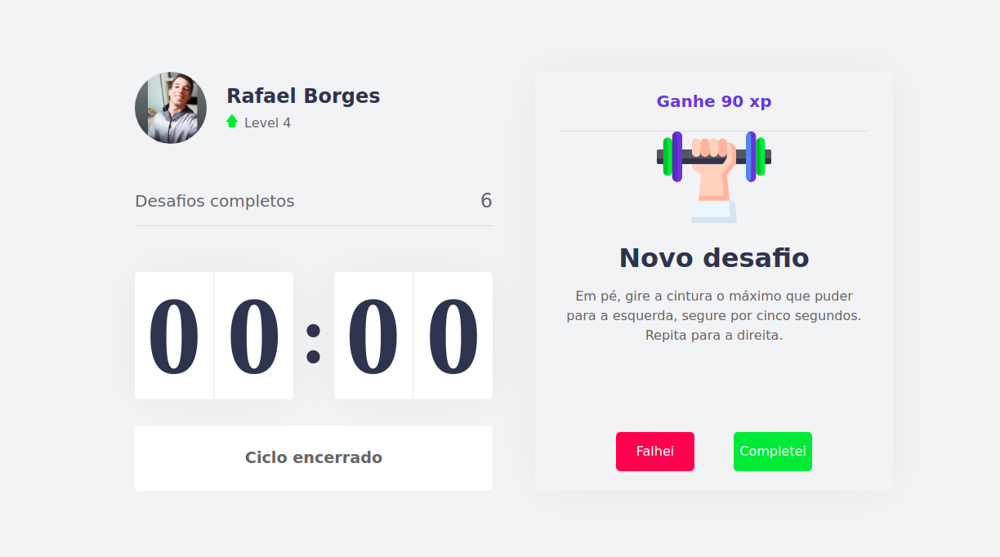
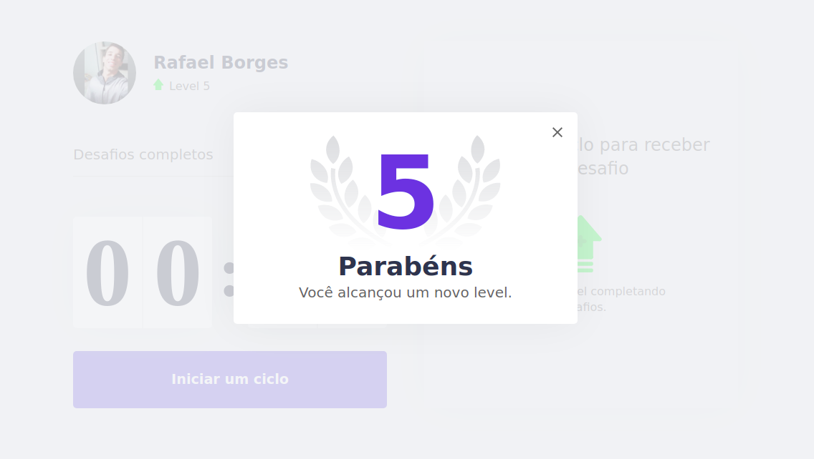
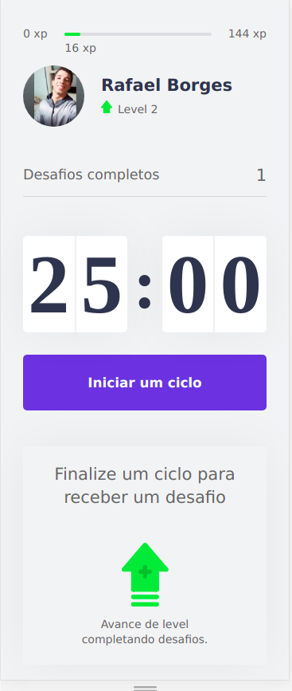

# Moveitnow

## Descrição do Projeto

O projeto utiliza da técnica pomodoro, que consiste no foco durante 25 minutos na tarefa e depois um tempo livre de descanso.

o projeto incentiva o uso desse tempo de descanso com tarefas simples e que ajudam a evitar problemas de visão e problemas corporais, tornando a experiência das tarefas melhores

<h1 align="center">
    <a href="https://moveitnow-one.vercel.app/">🔗 Moveitnow</a>
</h1>

🚀 Aplicação web moveitnow

<strong>Página inicial</strong>

<strong>Novo desafio</strong>

<strong>Novo level</strong>

<strong>Tela responsiva</strong>
 

### 🛠 Utilizar

Para utilizar localmente:

<ul>
	<li>clonar o repositório do github</li>
	<li>rodar o comando > git clone link-copiado</li>
	<li>rodar o comando > yarn add</li>
	

### 🛠 Tecnologias

As seguintes ferramentas foram usadas na construção do projeto:

- [Next](https://nextjs.org/)
- [React](https://pt-br.reactjs.org/)
- [TypeScript](https://www.typescriptlang.org/)

<h4 align="center"> 
	🚧  Moveitnow 🚀 Em construção...  🚧
</h4>

 
  
 <b>Rafael</b></a>

Feito por Rafael Borges 👋🏽 Entre em contato!

 

